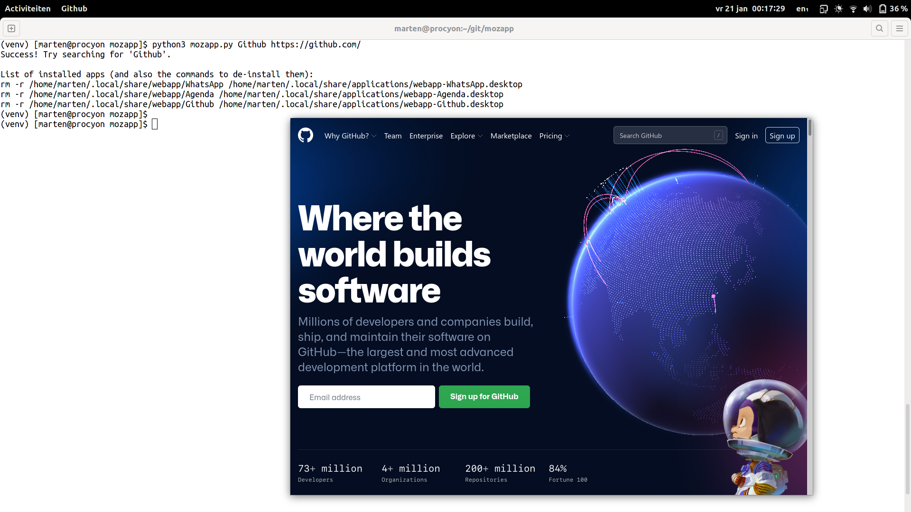

mozapp
======

Do you prefer Firefox to Chrome? Me too! But ever since Firefox dropped support
for standalone web applications, I've resorted to using Chrome for those. Better
than installing a bloated Electron app, but not ideal.

This is my best attempt at fixing the situation. Tested only using Firefox 96
and Gnome 3 using the Wayland protocol. It's a 100 line commented and
straightforward Python script.



Usage
-----

```bash
(venv) [marten@procyon mozapp]$ python3 mozapp.py
Usage: python3 mozapp.py Example https://example.com optional-icon-name

List of installed apps (and also the commands to de-install them):
rm -r /home/marten/.local/share/webapp/WhatsApp /home/marten/.local/share/applications/webapp-WhatsApp.desktop
rm -r /home/marten/.local/share/webapp/Agenda /home/marten/.local/share/applications/webapp-Agenda.desktop
```

```bash
(venv) [marten@procyon mozapp]$ python3 mozapp.py Skype https://web.skype.com/ call-start
Success! Try searching for 'Skype'.

List of installed apps (and also the commands to de-install them):
rm -r /home/marten/.local/share/webapp/WhatsApp /home/marten/.local/share/applications/webapp-WhatsApp.desktop
rm -r /home/marten/.local/share/webapp/Agenda /home/marten/.local/share/applications/webapp-Agenda.desktop
rm -r /home/marten/.local/share/webapp/Skype /home/marten/.local/share/applications/webapp-Skype.desktop
(venv) [marten@procyon mozapp]$ rm -r /home/marten/.local/share/webapp/Skype /home/marten/.local/share/applications/webapp-Skype.desktop
(venv) [marten@procyon mozapp]$
```

If you specify an icon name as third argument, it is used as-is in the resulting
``.desktop`` file. If you don't, ``mozapp`` will try to download the biggest
icon given by the web application (it visits the web app). In that case, you
need to have the ``favicon`` Python package installed from PyPI (e.g. using ``pip install favicon``).
